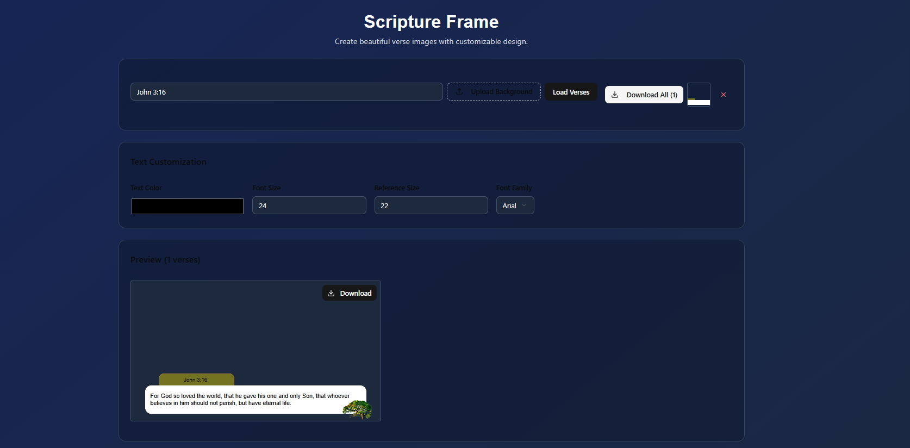
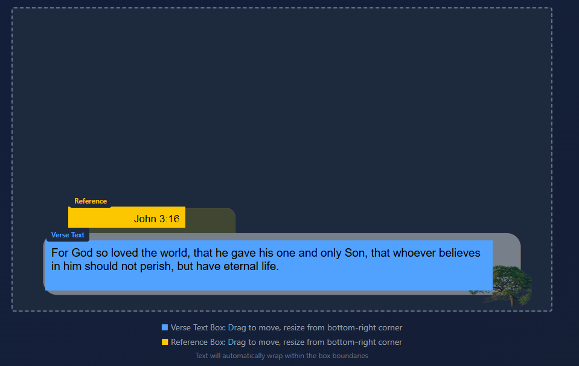

# Scripture Frame


A modern, intuitive web application for creating beautiful Bible verse images with customizable layouts and typography. Perfect for social media, presentations, or personal devotion materials.

## ✨ Features



### 📖 Verse Management
- **Flexible Input Format**: Support for various verse formats
  - Single verses: `john 3:16`
  - Verse ranges: `matt 25:31-33`
  - Multiple verses: `psalm 23:1,4,6`
- **Automatic Fetching**: Retrieves verse text from Bible API
- **Bulk Processing**: Load and process multiple verses at once

### 🎨 Visual Customization
- **Custom Backgrounds**: Upload your own background images
- **Typography Control**: 
  - Font family selection (7 popular fonts)
  - Adjustable font sizes for verse text and references
  - Color picker for text styling
- **Layout Designer**: 
  - Drag-and-drop text positioning
  - Resizable text boxes
  - Real-time preview updates

### 🖼️ Image Generation
- **High-Quality Output**: 1024x576px images (16:9 aspect ratio)
- **Individual Downloads**: Download single verse images
- **Bulk Export**: Download all verses at once
- **Canvas-Based Rendering**: Ensures consistent, high-quality output

### 📱 User Experience
- **Responsive Design**: Works on desktop, tablet, and mobile
- **Real-Time Preview**: See changes instantly
- **Intuitive Interface**: Clean, modern UI with helpful visual cues
- **Visual Editor**: Interactive canvas with color-coded text boxes

## 🚀 Getting Started

### Prerequisites
- Node.js 16+ 
- npm or yarn package manager

### Installation

1. **Clone the repository**
   ```bash
   git clone https://github.com/yourusername/scripture-frame.git
   cd scripture-frame
   ```

2. **Install dependencies**
   ```bash
   npm install
   # or
   yarn install
   ```

3. **Start development server**
   ```bash
   npm run dev
   # or
   yarn dev
   ```

4. **Open in browser**
   Navigate to `http://localhost:3000`

## 📋 Usage Guide



### Basic Workflow

1. **Enter Verse Reference**
   - Type a verse reference in the input field (e.g., "john 3:16")
   - Press Enter or click "Load Verses"

2. **Customize Appearance**
   - Upload a background image (optional)
   - Adjust font size, family, and color
   - Modify reference text size

3. **Position Text**
   - Use the interactive editor to drag text boxes
   - Resize boxes by dragging the bottom-right corner
   - Preview updates in real-time

4. **Download Images**
   - Click individual "Download" buttons for single images
   - Use "Download All" for bulk export

### Supported Verse Formats

| Format | Example | Description |
|--------|---------|-------------|
| Single verse | `john 3:16` | One specific verse |
| Verse range | `matt 5:3-12` | Consecutive verses |
| Multiple verses | `psalm 23:1,4,6` | Non-consecutive verses |
| Mixed format | `rom 8:28,31-39` | Combination of single and range |

### Font Options
- Arial (default)
- Georgia
- Times New Roman
- Courier New
- Verdana
- Tahoma
- Helvetica

## 🛠️ Technology Stack

### Frontend Framework
- **React 18** with TypeScript
- **Tailwind CSS** for styling
- **Lucide React** for icons

### UI Components
- **shadcn/ui** component library
- Custom drag-and-drop implementation
- Canvas API for image generation

### External APIs
- **Bible API** (bible-api.com) for verse text retrieval

### Build Tools
- **Vite** for fast development and building
- **ESLint** for code quality
- **Prettier** for code formatting

## 🎯 Key Components

### Core Features
- `BibleVerseFormatter`: Main application component
- `TextEditor`: Interactive canvas for positioning text
- `ImageGenerator`: Canvas-based image creation
- `VerseParser`: Handles various verse format parsing

### State Management
- React hooks (`useState`, `useEffect`)
- Local state for verse data, styling, and layout
- No external state management needed

## 📝 Configuration

### Default Settings
```javascript
const DEFAULT_STYLE = {
  fontSize: 24,        // Verse text size
  titleSize: 16,       // Reference text size
  fontFamily: "Arial", // Default font
  color: "#ffffff"     // White text
};

const CANVAS_DIMENSIONS = {
  width: 1024,         // Output image width
  height: 576          // Output image height (16:9 ratio)
};
```

### Customization Options
- Modify font list in the `fonts` array
- Adjust canvas dimensions for different aspect ratios
- Change default styling values
- Add new background options

### Development Setup
1. Fork the repository
2. Create a feature branch: `git checkout -b feature/amazing-feature`
3. Make your changes
4. Test thoroughly
5. Commit: `git commit -m 'Add amazing feature'`
6. Push: `git push origin feature/amazing-feature`
7. Open a Pull Request

---

**Made with ❤️ and faith** - Spreading God's word through beautiful design.
